<picture>
  <source media="(prefers-color-scheme: dark)" srcset="dark.svg">
  <source media="(prefers-color-scheme: light)" srcset="light.svg">
  
</picture>

 

## 🚀 About Me

- 🎓 B.Tech student in Delhi, focused on **Software Engineering & Web Development**
- 🧠 Building at the intersection of **Full Stack Development** and **AI / ML Automation**
- 🏆 Active hackathon builder — ICU predictive monitoring, civic-tech, carbon analytics, offroad AI segmentation
- 🌱 Currently exploring deeper **LLM tooling, agentic automation, and production ML pipelines**
- 💬 Ask me about **React / Next.js, TypeScript, Python, or AI-assisted product builds**

---

## 🛠️ Featured Projects

<table>
<tr>
<td width="50%" valign="top">

### 🧠 [Chronos Clinical OS](https://github.com/Ayushrai987/Chronous)
ICU monitoring system using an LSTM + Multi-Head Attention model for 2–6 hour deterioration prediction, with SHAP-based explainability and a real-time glassmorphism dashboard. Built during a GTBIT hackathon — 1 star, 3 forks.

`Python` `PyTorch` `FastAPI` `React` `WebSockets`

</td>
<td width="50%" valign="top">

### 🌍 [Carbon Footprint Platform](https://github.com/Ayushrai987/carbon-footprint-platform)
Production-grade carbon tracking app with real-time CO₂ calculation across 30+ activity types, AI-driven personalized reduction tips, and gamified progress tracking (badges, streaks, leaderboard).

`React` `TypeScript` `Node.js` `SQLite` `JWT`

</td>
</tr>
<tr>
<td width="50%" valign="top">

### 🗳️ [VoteBuddy](https://github.com/Ayushrai987/VoteBuddyy)
Non-partisan civic-tech platform for Indian voters — bilingual (EN/HI) UI, state & booth explorer, live results dashboard with Recharts, and a Claude-powered AI voter assistant.

`Next.js 14` `TypeScript` `Recharts` `Claude API`

</td>
<td width="50%" valign="top">

### 🏜️ [Offroad Scene Segmentation](https://github.com/Ayushrai987/Creative-codex--xenothon)
Semantic segmentation model (DINOv2 ViT-B/14 backbone + custom ConvNeXt decoder head) for autonomous offroad navigation — improved validation IoU from 0.29 to 0.73.

`PyTorch` `DINOv2` `Computer Vision`

</td>
</tr>
</table>

---

## 💻 Tech Stack

---

## 📊 GitHub Stats

---

## 🔗 Connect

<i>&lt;/&gt; building things that matter</i>

